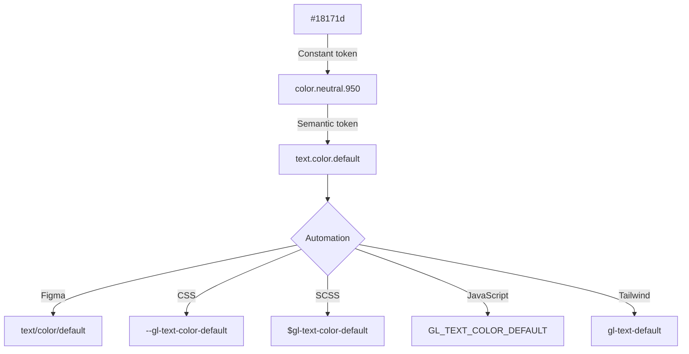

# Design tokens

KhulnaSoft UI uses design tokens to maintain a single source of truth that, through automation, can be
formatted for different uses. See
[Pajamas](https://design.gitlab.com/product-foundations/design-tokens) for an overview on design
tokens.

[[_TOC_]]

## Usage

We manage design tokens in this repository which is published on npm, and managed as a dependency
with yarn. To upgrade to a new version run `yarn upgrade @khulnasoft/ui`. To build tokens locally run
 `yarn build-tokens`.

Design tokens are provided in different modes (default/dark) and file formats for use in CSS (custom
properties), JavaScript (ES6 Constants/JSON), and SCSS (variables), for example:

### CSS

```css
@import '@khulnasoft/ui/src/tokens/build/css/tokens';

h1 {
  color: var(--gl-text-color-heading); /* #18171d */
}
```

### SCSS

```scss
@import '@khulnasoft/ui/src/tokens/build/scss/tokens';

h1 {
  color: $gl-text-color-heading; /* #18171d */
}
```

### JavaScript

```js
import { GL_TEXT_COLOR_HEADING } from '@khulnasoft/ui/src/tokens/build/js/tokens';

const color = GL_TEXT_COLOR_HEADING; // #18171d
```

### Dark mode

Where color design tokens are updated for dark mode, their values are provided with the same name in
files appended with `.dark`, for example:

CSS:

```css
@import '@khulnasoft/ui/src/tokens/build/css/tokens.dark';

h1 {
  color: var(--gl-text-color-heading); /* #fff */
}
```

SCSS:

```scss
@import '@khulnasoft/ui/src/tokens/build/scss/tokens.dark';

h1 {
  color: $gl-text-color-heading; /* #fff */
}
```

JavaScript:

```js
import { GL_TEXT_COLOR_HEADING } from '@khulnasoft/ui/src/tokens/build/js/tokens.dark';

const color = GL_TEXT_COLOR_HEADING; // #fff
```

## Design token format

Our design tokens use the [Design Tokens Format Module](https://tr.designtokens.org/format/) for
defining design tokens that integrate with different tools and are converted to required file
formats. It's a [community group draft report](https://www.w3.org/standards/types/#reports),
published by the [Design Tokens Community Group](https://www.w3.org/community/design-tokens/).

The Design Tokens Format Module promotes a `*.token.json` extension standard for design token files,
with a format that includes [a name and
`$value`](https://tr.designtokens.org/format/#name-and-value) and an explicit
[`$type`](https://tr.designtokens.org/format/#type-0):

```json
// text.color.tokens.json
{
  "heading": {
    "$value": "#18171d",
    "$type": "color"
  }
}
```

### Automation

Our design tokens use [Style Dictionary](https://amzn.github.io/style-dictionary/) to compile design
tokens into consumable file formats (CSS/SCSS/JavaScript/JSON).

#### Transforms

[Transforms](https://amzn.github.io/style-dictionary/#/api?id=registertransform) modify design
tokens before being compiled and are used to prefix compiled output, and use [mode](#modes) values
when provided.

#### Transform groups

[Transform groups](https://amzn.github.io/style-dictionary/#/api?id=registertransform) apply
transforms to platforms, for example, CSS and JavaScript have different transform groups for casing
`kebab-case` for CSS and SCSS output, `CONSTANT_CASE` for JavaScript output.

#### Parser

A parser makes [Design Tokens Format Module
properties](https://tr.designtokens.org/format/#design-token-properties) compatible with [Style
Dictionary design token
attributes](https://amzn.github.io/style-dictionary/#/tokens?id=design-token-attributes).

| Design Tokens Format Module                                                | Style Dictionary                                                                                                                    |
| -------------------------------------------------------------------------- | ----------------------------------------------------------------------------------------------------------------------------------- |
| [`$value`](https://tr.designtokens.org/format/#name-and-value) property    | [`value`](https://amzn.github.io/style-dictionary/#/tokens?id=design-token-attributes) property                                     |
| [`$type`](https://tr.designtokens.org/format/#type-0) property             | implicit nested [`category → type → item` (CTI) convention](https://amzn.github.io/style-dictionary/#/tokens?id=category-type-item) |
| [`$description`](https://tr.designtokens.org/format/#description) property | [`comment`](https://amzn.github.io/style-dictionary/#/tokens?id=design-token-attributes) property                                   |

Example design token inheritance and automation:



### Names

A design token [name](https://tr.designtokens.org/format/#name-and-value) is a unique and
case-sensitive identifier of a value.

Names have [character restrictions](https://tr.designtokens.org/format/#character-restrictions)
including:

1. Names must not begin with `$`
1. Names must not contain `{` or `}`
1. Names must not contain `.`

### Groups

[Groups](https://tr.designtokens.org/format/#groups) are arbitrary ways to cluster tokens together
in a category. They should not be used to infer the type or purpose of design tokens. For that
purpose, use the [`$type`](#type) property.

```json
{
  "color": {
    "heading": {
      "$value": "#18171d",
      "$type": "color"
    }
  }
}
```

Groups can also be nested for greater context setting:

```json
{
  "text": {
    "color": {
      "heading": {
        "$value": "#18171d",
        "$type": "color"
      }
    }
  }
}
```

Group names prepend design token names in generated output, for example:

CSS:

```css
:root {
  --gl-text-color-heading: #18171d;
}
```

SCSS:

```scss
$gl-text-color-heading: #18171d;
```

JavaScript:

```javascript
const GL_TEXT_COLOR_HEADING = '#18171d';
```

### Values

Name and `$value` are the minimum required properties of a design token, `$value` is a reserved
word.

```json
{
  "token name": {
    "$value": "16"
  }
}
```

A design token value can be a string or [alias](#aliases), for example:

| Example       | Value             |
| ------------- | ----------------- |
| color         | `#18171d`         |
| font weight   | `bold`            |
| spacing scale | `16`              |
| easing        | `ease-out`        |
| duration      | `200`             |
| alias         | `{color.default}` |

### Aliases

[Aliases](https://tr.designtokens.org/format/#aliases-references) allow a design token value to
reference to another token, for example the alias token `custom-token` has the value
`{text.color.heading}`:

```json
{
  "custom-token": {
    "$value": "{text.color.heading}"
  }
}
```

This allows generated CSS and SCSS that are output by using [Output
References](https://amzn.github.io/style-dictionary/#/formats?id=references-in-output-files) to use
references as variables:

CSS:

```css
:root {
  --gl-custom-token: var(--gl-text-color-heading);
}
```

SCSS:

```scss
$gl-custom-token: $gl-text-color-heading;
```

### Type

An optional [$type](https://tr.designtokens.org/format/#type-0) property is used for tools to
reliably interpret their value.

```json
{
  "token name": {
    "$value": "#000",
    "$type": "color"
  }
}
```

### Extensions

The Design Tokens Format Module allows for  
[extensions](https://tr.designtokens.org/format/#extensions),  
which are custom properties that provide additional metadata or functionality.  
Refer to the format module for authoring extensions.  

#### com.figma.scope

Indicates a token's scope within Figma. Value is an array (even for tokens with a single scope)  
and should follow the [VariableScope](https://www.figma.com/plugin-docs/api/VariableScope/)  
type from Figma's Plugin API.

```json
{
  "text": {
    "$value": "#000",
    "$type": "color",
    "$extensions": {
      "com.figma.scope": ["TEXT_FILL"],
    }
  },
  "icon": {
    "$value": "#333",
    "$type": "color",
    "$extensions": {
      "com.figma.scope": ["SHAPE_FILL", "STROKE_COLOR"],
    }
  }
}
```

#### com.gitlab.deprecated

Indicates that a token is slated to be removed in the future and should
no longer be used in new contexts.  
It helps teams identify which tokens are outdated and plan for their eventual removal.

```json
{
  "button": {
    "$value": "#c0ffee",
    "$type": "color",
    "$extensions": {
      "com.gitlab.deprecated": true,
    }
  }
}
```

#### com.gitlab.locked

Indicates that a token has a restricted scope of use and should not be
used outside a single component.  
This is useful for maintaining strict design consistency within specific components.

```json
{
  "button": {
    "$value": "#c0ffee",
    "$type": "color",
    "$extensions": {
      "com.gitlab.locked": true,
    }
  }
}
```

## Modes

Modes allow design tokens to update value for different use cases, for example, light and dark mode
colors.

Modes are defined as an object in the `$value` property:

```json
{
  "text-color": {
    "$value": {
      "default": "#000",
      "dark": "#fff"
    },
    "$type": "color"
  }
}
```

When defined each mode value is compiled into separate output:

CSS:

`tokens.css`

```css
:root {
  --text-color: #000;
}
```

`tokens.dark.css`

```css
:root {
  --text-color: #fff;
}
```

SCSS:

`tokens.scss`

```scss
$text-color: #000;
```

`tokens.dark.scss`

```scss
$text-color: #fff;
```

JavaScript:

`tokens.js`

```javascript
export const TEXT_COLOR = '#000';
```

`tokens.dark.js`

```javascript
export const TEXT_COLOR = '#fff';
```

## Adding and editing design tokens

1. Create a new constant design token when there's a need for a reusable value that represents a
specific design attribute across the system, otherwise keep new values limited to a specific
context.
   1. Follow existing naming conventions.
   1. Keep in mind that a new constant design token encourages wider use while a contextual one has
   limited use.
1. A new or edited token should be reviewed by ~"group::design system" to ensure it aligns with the
system.

## Deprecation

Add `"deprecated": true` to deprecated token JSON. When all tokens in a file are deprecated move to
a `deprecated.*.json` file.
